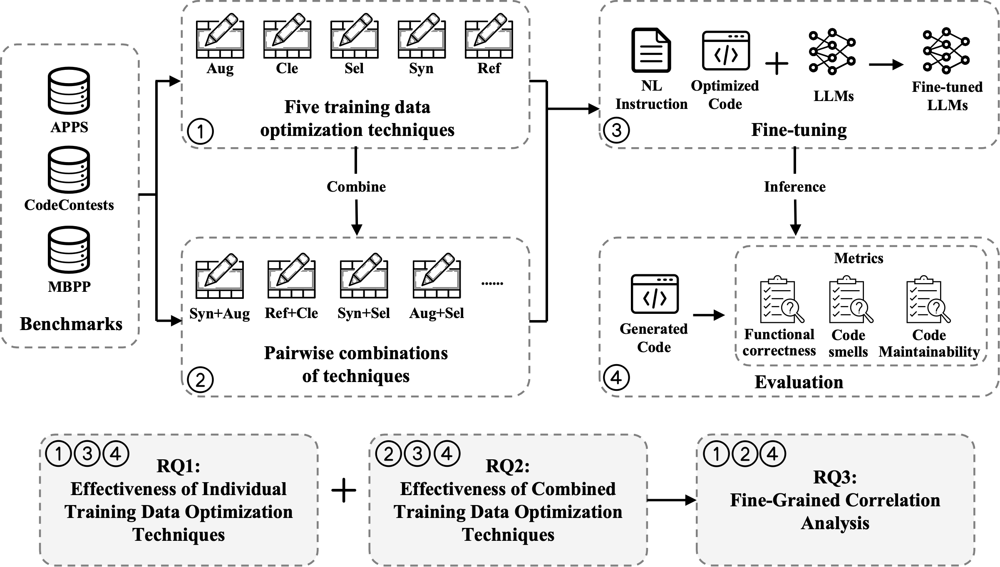

# On the Effectiveness of Training Data Optimization for LLM-Based Code Generation: An Empirical Study

## 1. Overview

This repository contains two parts:

1. **Training data optimization techniques pipeline**  
   Entry: `optimize.py` → `Techniques/{Aug,Cle,Ref,Sel,Syn}/`
2. **Fine-tune + Inference + Evaluation**  
   Entry: `sft.py` → `SFT/finetune.py`, `SFT/evaluation.py`

Supported datasets: **APPS / CodeContests / MBPP**.

## 2. Datasets
The datasets can be downloaded from this [Zenodo](https://zenodo.org/records/18035491). After decompressing this file, the folder structure is as follows.
```
Datasets/
├── apps
│   ├── test.jsonl
│   ├── train_aug.jsonl
│   ├── train_aug_cle.jsonl
│   ├── train_aug_sel.jsonl
│   ├── train_cle.jsonl
│   ├── train_cle_sel.jsonl
│   ├── train_ori.jsonl
│   ├── train_ref.jsonl
│   ├── train_ref_aug.jsonl
│   ├── train_ref_cle.jsonl
│   ├── train_ref_sel.jsonl
│   ├── train_sel.jsonl
│   ├── train_syn.jsonl
│   ├── train_syn_aug.jsonl
│   ├── train_syn_cle.jsonl
│   ├── train_syn_ref.jsonl
│   ├── train_syn_sel.jsonl
│   └── valid.jsonl
├── codecontests
│   ├── ......
└── mbpp
    ├── ......
```

## 3. Training data optimization techniques

- Data Augmentation——[SPAT](https://github.com/Santiago-Yu/SPAT)
- Data Cleaning——[Quality in Quality out...](https://github.com/cristinaimprota/Investigating-Training-Data-s-Role)
- Data Selection——[SCAR](https://github.com/zhuang-li/SCAR)
- Data Refactoring——DataRecipe, [Autopep8](https://github.com/hhatto/autopep8), [Autoflake](https://github.com/PyCQA/autoflake), [Docformatter](https://github.com/PyCQA/docformatter), [Unify](https://github.com/myint/unify)
- Data Synthesis——[WaveCoder](https://github.com/microsoft/WaveCoder)

In this work, we used the GitHub repository for data selection and data cleaning, and reproduced the processes of data augmentation, data reconstruction, and data synthesis.


## 4. Experiments

### (1) Create Environment
```
conda create -n study python=3.8
conda activate study
pip install -r requirements.txt
```

### (2) Optimize Training data
Use `python optimize.py` to optimize data.

Take data augmentation in APPS as an example:
```
python optimize.py --dataset apps --tech aug
```
`--dataset` parameter can only be one of ["apps", "codecontests", or "mbpp"], while `tech` can only be on of ["aug", "cle", "sel", "ref", "syn"].

For the combinations of techniques, after applying the first technique, please change the `input_path` in `Techniques/<tech>/run.py` to apply the second technique.

### (3) Fine-tune, inference and test
Use `python sft.py` to optimize data.

Take LLama3.2-1B-Instruct in APPS with data augmentation and as an example:
```
python optimize.py --dataset apps --model llama1 --tech aug --train --eval
```
`--dataset` parameter can only be one of ["apps", "codecontests", "mbpp"], `--model` parameter can only be on of ["llama1", "llama3", "qwen1.5", "qwen3"], `--tech` parameter can only be on of ["aug", "cle", "sel", "ref", "syn"]. `--train` parameter determines whether fine-tuning is performed, `--eval` parameter determines whether inference and testing are performed.

Generated code is saved in `Results/<dataset>/<model>/<tech>/all_code.json`, and the test results are saved in `Results/<dataset>/<model>/<tech>/test.txt`, including pass@1, avgpassratio, code smell scores, and maintainability index. Model checkpoints will be stored in the `Model/<dataset>/<model>/<tech>/checkpoint-*/` folder.

### (4) Results
We have open-sourced the results of our research and saved them in the `Results` folder, the folder structure is as follows.
```
Results/
├── apps
│   ├── LM-1B
│   │   ├── Aug.jsonl
│   │   ├── Aug_Cle.jsonl
│   │   ├── Aug_Sel.jsonl
│   │   ├── Cle.jsonl
│   │   ├── Cle_Sel.jsonl
│   │   ├── Ori.jsonl
│   │   ├── Ref.jsonl
│   │   ├── Ref_Aug.jsonl
│   │   ├── Ref_Cle.jsonl
│   │   ├── Ref_Sel.jsonl
│   │   ├── Sel.jsonl
│   │   ├── Syn.jsonl
│   │   ├── Syn_Aug.jsonl
│   │   ├── Syn_Cle.jsonl
│   │   ├── Syn_Ref.jsonl
│   │   └── Syn_Sel.jsonl
│   ├── LM-3B
│   │   ├── ......
│   ├── QW-1.5B
│   │   ├── ......
│   └── QW-3B
│       ├── ......
├── codecontests
│   ├── ......
└── mbpp
    ├── ......
```

## 5. Acknowledgements

We are very grateful that the authors of SPAT, Quality in Quality out..., WaveCoder, SCAR, Autopep8, Autoflake, Docformatter, Unify  make their code publicly available so that we can build this repository on top of their code. 
